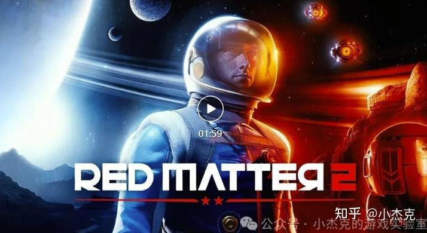

# 混合现实（MR）游戏开发入门

近年来，虚拟现实（VR）、增强现实（AR）和混合现实（MR）技术的迅速崛起，推动了游戏开发进入全新的维度。作为一名VR/MR游戏开发者，我亲眼见证了技术的不断进步与升级。从微软第一代HoloLens头显到HTC Vive，再到Quest、Quest 2，直到如今为Meta Quest 3开发游戏，我深刻感受到了这些技术如何颠覆传统2D和3D视觉表现，并重新定义了游戏的交互方式和沉浸感体验。

许多朋友常常问我：“VR、AR和MR有何区别？”、“购买哪个头显最合适？”、“有哪些好玩的VR、MR游戏？”为了解答这些问题，我决定写这篇文章，探讨这三种技术的核心特点及其在游戏中的应用，介绍主流游戏设备，并为开发者梳理Meta Quest 3的Unity开发路线。

## VR游戏：沉浸式虚拟体验

VR（虚拟现实）游戏让玩家通过头戴显示设备（HMD）完全沉浸在虚拟环境中。通过视觉、听觉以及手柄的振动反馈，VR游戏为玩家提供了高度的沉浸感。

推荐一款科幻风的VR游戏——《红色物质2》（Red Matter 2）。这款屡获殊荣的沉浸式解谜冒险游戏，让玩家扮演特工Sasha，在月球基地揭开神秘的“红物质”背后的秘密。游戏使用优化后的Unreal Engine进行渲染，营造了一个科幻的环境，带来极具沉浸感的游戏体验。

## AR游戏：现实与虚拟的融合

与VR游戏不同，AR游戏通过智能手机、AR眼镜或平板电脑等设备，通过设备上的摄像头捕捉现实世界图像，并将虚拟物体叠加到这些现实图像中，从而为玩家呈现现实与虚拟融合的场景。

推荐一款AR手机游戏——《宇宙战线 AR》。在这款游戏中，玩家将化身为宇宙舰队指挥官，指挥自己的舰队在浩瀚的宇宙中与敌人展开激烈战斗。游戏利用AR技术将虚拟战舰与现实环境结合，你在家中的客厅可以指挥舰队与敌舰、激光炮火展开战斗。

## MR游戏：虚拟与现实的深度交互

MR（混合现实）游戏将VR和AR的特点结合，提供更为自然的交互体验。玩家佩戴MR头显后，不仅能看到虚拟元素，还能与真实世界进行深度互动。MR设备通过理解周围环境，实现虚拟元素与现实物体的实时交互。

推荐最新发行的MR游戏—《空间特工队》（Spatial Ops）。这款游戏被誉为MR模式下的FPS游戏，提供单人战役模式与竞技场模式。在单人模式中，玩家扮演一名特工，在激烈的射击战斗中保护现实世界；而竞技场模式则让玩家将家中的空间瞬间转变为战场，体验科幻版的CS。

## 设备推荐：主流硬件分析

在VR、AR和MR技术中，目前VR和MR游戏应用最为广泛。以下是一些主要硬件设备的介绍：

**Meta Quest系列**：由Facebook推出，是全球销量领先的头显设备。以Quest 3为例，这款设备搭载了骁龙XR2 Gen 2处理器，单眼分辨率高达2064×2208，刷新率可达到90Hz，售价大约在3000-4000元之间，是同价位中性能表现最优的选择。游戏需要通过Meta商店购买，由于网络原因，在国内使用时需要借助加速器。适合对硬件配置和系统设置有一定了解的用户。

**Pico系列**：作为国内VR/MR市场的领先品牌，Pico系列在2024年推出了与Quest 3竞争的Pico 4 Ultra。这款设备同样搭载骁龙XR2 Gen 2处理器，功能与Quest 3类似，尽管平台上的游戏数量不及Meta多，但在国内使用时无需加速器，适合更广泛的用户群体。

**Vision Pro**：苹果公司于2024年推出的Vision Pro是高端MR设备的代表，配备M2芯片，单眼分辨率高达3660×3200，是市场上计算能力最强的头显之一。Vision Pro支持沉浸度调节，并可在MR和VR模式之间自由切换。然而，由于该设备未配备手柄，游戏交互主要依赖手势控制。因此，目前适配的游戏多为棋牌类和休闲类游戏。设备售价接近3万元，适合追求极致显示效果的用户。

## 开发路线：从头开始

对于开发者，以下是从Meta Quest 3+Unity的开发路线，帮助你一步步准备好开发环境。

1. 确定游戏体验方式：首先要确定游戏的体验方式，是完全沉浸式的VR体验，还是混合现实的MR体验。现在很多游戏提供两种模式，供玩家自由切换。

2. 选择游戏引擎：目前，Meta Quest平台上的游戏大多数使用Unity开发，约70%-80%是Unity开发的，剩余的20%-30%使用Unreal Engine（UE）或其他引擎。可以根据个人技术背景和需求选择适合的引擎。

3. 准备硬件设备和开发者账号：尽管Meta提供了Meta XR Simulator头显模拟器等工具，许多复杂的场景和性能测试仍需真实设备进行验证。建议购买Quest 3并使用Windows系统的PC进行开发。所有Meta Horizon Store上的应用发布者都需要在Meta开发者中心创建开发者账号。

4. 安装Meta开发工具：Meta Quest Developer Hub：Meta提供的开发应用，可进行头显设备设置、性能分析、安装游戏软件以及访问学习资源。Meta Quest Link：通过USB-C或WiFi连接头显到Windows电脑，使用Link模式可以在Quest中直接查看Unity或Unreal游戏运行效果，无需重新编译，提高研发效率。

## 配置Unity

Unity的配置主要包括以下几个方面：安装Meta的SDK（All-in-One）、修改项目的目标平台、使用Meta Project Setup Tool进行默认参数设置，安装Meta开发模拟器等。基本功能可以通过添加Building Blocks进行快速实现，详细信息可参考相关文档。

## 学习MR相关模块

如果开发MR游戏，建议阅读官方的《MR设计指南》，了解常见的基本概念。你还需要熟悉以下功能模块：Passthrough、Scene、Spatial Anchors和MRUK工具包。在Meta Quest Developer Hub中，可以查找相关模块的代码示例进行补充学习。

按照上述步骤，你就可以在Unity中开始编写MR应用，逐步实现“Hello World”级别的MR项目。

## 总结
希望通过这篇文章，大家能够对VR、AR、MR技术和游戏开发有所了解，并能根据自己的兴趣和需求开发自己喜欢的游戏。从选择合适的设备到配置开发环境，逐步走向开发成功的第一步。