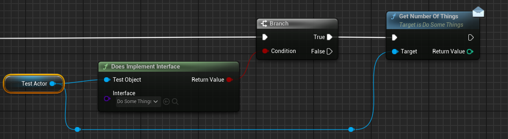

# UE C++ 相关内容总结

## 1.作为 UE 程序员为什么都需要掌握 UE C++和蓝图编程？

因为二者在引擎中的定位不同，却又相辅相成：

- **C++**: 负责底层基础，适合实现性能关键模块、框架系统，以及扩展引擎功能。  
- **蓝图**：面向上层逻辑，强调快速迭代、关卡交互和玩法组合，方便策划与美术直接参与。  

只会 C++，灵活性不足，每次修改逻辑都要重新编译，效率低； 只会蓝图，性能和功能有限，无法胜任复杂系统（如多人联机、GAS、定制渲染管线）。所以最佳实践是 C++ 写底层与性能逻辑，蓝图处理上层与关卡逻辑。一句话总结：C++ 打地基，蓝图盖房子；两者结合，才能高效又稳健。

## 2. UE C++和普通 C++的区别

Unreal Engine（UE）在底层使用 C++ 语言开发，但 UE C++ 并不等同于标准 C++，它有自己的一套扩展体系和开发规范。

### 2.1 UE 对象体系：UObject 和 Actor

UE 对象由引擎管理生命周期，普通 C++ 对象需要手动管理。  
- **普通 C++**：类是普通的类型，继承和生命周期完全由程序员控制。  
- **UE C++**：所有游戏对象大多继承自 UObject 或 AActor。UE 引入**垃圾回收**（Garbage Collection） 管理 UObject 生命周期。内存分配与销毁不建议直接 new/delete，而是通过 UE 自动进行。

```C++
// 普通 C++
MyClass* Obj = new MyClass();
delete Obj;

// UE C++， 不用手动 delete，GC 会管理
UObject* Obj = NewObject<UMyObject>();
```

### 2.2 UE 宏与反射系统

普通 C++ 无法直接支持蓝图编辑器、序列化和 GC，UE C++ 通过宏实现。
- **普通C++**：没有内置的反射，属性、函数都不能在运行时被动态访问。
- **UE C++**：使用宏 UCLASS, UPROPERTY, UFUNCTION 扩展类、变量、函数。实现运行时类型信息、序列化、蓝图可访问、网络同步等。
```C++
UCLASS()
class AMyActor : public AActor
{
    GENERATED_BODY()

public:
    UPROPERTY(EditAnywhere, BlueprintReadWrite)
    int32 Health;

    UFUNCTION(BlueprintCallable)
    void TakeDamage(int32 Amount);
};
```

### 2.3指针与智能指针

UE 自带指针体系，兼容 GC 和蓝图系统。
- **普通 C++**：*、&、std::shared_ptr、std::unique_ptr 常用。
- **UE C++**：强烈依赖 UObject* 指针，由 GC 管理。对非 UObject 类型可以使用 UE 提供的智能指针 TSharedPtr、TWeakPtr、TUniquePtr 专门用于非 UObject 类型的对象管理。新版本引入 TObjectPtr 以增强指针安全性。

### 2.4编译机制与模块化

UE 编译器不只是 C++ 编译，还包括宏解析、蓝图接口生成等。
- **普通 C++**：编译器直接处理 .cpp 文件，依赖头文件。模板和宏在编译时展开。
- **UE C++**：UE 引入 UHT（Unreal Header Tool） 解析 UCLASS、UPROPERTY、UFUNCTION 宏，生成辅助代码.generated.h 文件。UBT(Unreal Build Tool)负责整个 UE 项目的构建管理。整个编译过程如下：
```
1. 开始：写代码
   ├── .h/.cpp 文件（包含 UCLASS / UPROPERTY / UFUNCTION 宏）
   └── .Build.cs / .Target.cs 配置模块依赖

2. 调用 Unreal Build Tool (UBT)
   ├── 解析 .uproject、.Build.cs、.Target.cs
   ├── 计算模块依赖
   └── 判断哪些模块需要编译

3. 调用 Unreal Header Tool (UHT)
   ├── 扫描所有头文件
   ├── 解析 UCLASS / USTRUCT / UPROPERTY / UFUNCTION
   └── 生成 .generated.h 文件（反射、GC、蓝图注册）

4. 回到 UBT
   ├── 收集 .cpp + 生成的 .generated.h
   ├── 调用编译器（MSVC / Clang / LLVM）
   └── 编译生成模块对象文件 (.obj)

5. 链接阶段
   ├── 按模块依赖顺序链接各个 .obj
   └── 生成最终二进制：
        - 编辑器：.dll
        - 游戏可执行：.exe / 目标平台二进制      

6. 完成
   └── 可运行的游戏或模块加载到 UE 编辑器
```

### 2.5蓝图与可视化支持
- 普通 C++：无法直接被可视化工具访问。
- UE C++：可通过 BlueprintCallable、BlueprintReadWrite 等宏让 C++ 类和函数暴露给蓝图。可视化编辑器和 C++ 无缝结合，大幅提升开发效率。

### 2.6事件、委托和回调
- 普通 C++：通过函数指针、std::function、虚函数实现回调。
- UE C++：提供 Delegate、MulticastDelegate、Event，封装函数指针和对象绑定。支持动态绑定、蓝图可调用。

## 3.关于裸指针 T*

指针本质就是：记录一个对象在内存中的地址。当你想操作某个对象时，持有它的指针就能直接访问它，而不是重新创建一个副本。T*（原始指针）：直接指向对象内存，不参与垃圾回收，也不能自动保存/加载（不可序列化），容易悬空。引用的对象销毁时不会自动清理指针。
举个例子：

```C++
APlayerController* PC = GetWorld()->GetFirstPlayerController();
```
这里我们并没有“新建”一个 PlayerController，而是找到了当前世界里已有的对象，并保存了它的内存地址到 PC。之后我们就可以通过 PC 调用它的函数或访问变量。在使用指针前，需要检查指针是不是 nullptr。例如，我们使用 controller 设置游戏的输入模式。

```C++
if (PC)
{
    PC->SetInputMode(FInputModeGameAndUI());
}
```

例如，我们在一个 Character 子类 HeroCharacter.h 和 HeroCharacter.cpp 中，添加 CameraComponent，使用下面的方法，创建 CameraComponent 实例。Character 会负责子组件的生命周期。

```C++
//HeroCharacter.h

UPROPERTY(VisibleAnywhere)
UCameraComponent* CameraComp;

//HeroCharacter.cpp

CameraComp = CreateDefaultSubobject<UCameraComponent>(TEXT(「CameraComp」));
CameraComp->SetupAttachment(RootComponent);
```

## 4.关于 TObjectPtr
在虚幻 5 以后，推荐使用 TObjectPtr 替换*,上面的可以写成下面的方式
```C++
UPROPERTY(VisibleAnywhere)
TObjectPtr<UCameraComponent> CameraComp;
```

`TObjectPtr<T>`：轻量级智能指针，参与 GC 垃圾回收，指向对象被销毁时自动置空，可序列化，适合 UPROPERTY 成员使用。

建议：在 UE5 中，凡是 UObject 成员且需要序列化、编辑器操作或 GC 管理，都推荐使用`TObjectPtr<T>`，几乎是裸指针的安全升级版。

## 5.软引用 TSoftObjectPtr
在 Unreal Engine 5 中，TSoftObjectPtr（软引用）是一种存储资产路径而非直接指向对象的指针。适合大型资源、插件化资产或延迟加载资源，能够节省内存和加快启动速度。具有延迟加载，节约内存，运行时显式加载。例如：

```
UPROPERTY(EditAnywhere)
TSoftObjectPtr<UMaterial> WeaponMaterial; // 保存路径而不占内存

void ApplyMaterial()
{
    if (WeaponMaterial.IsValid())
    {
        MyMesh->SetMaterial(0, WeaponMaterial.LoadSynchronous()); // 显式加载
    }
}
```

## 6.弱引用 TWeakObjectPtr
弱引用不会阻止 GC 回收对象，对象被销毁后，指针自动失效，不会悬空。访问前需要进行 IsValid()检查。比如，标记最近攻击敌人,敌人有可能被击杀。当敌人被销毁后，指针自动失效，避免悬空，不阻止 GC 回收。

```C++
TWeakObjectPtr<AActor> LastHitEnemy = EnemyA;
if(LastHitEnemy.IsValid())
{
    LastHitEnemy->Destory();
}
```

## 7.访问运算符「.」和「->」
平时使用，通过编码 IDE 自动提示即可。
- 「.」访问对象的实例成员，结构体类型使用。比如，FVector, FRotator,FTransform,FHitResult, FColor
- 「->」访问指针所指对象的成员。比如，UObject, AActor,UActorComponent

## 8. 静态函数
静态函数特点是属于类本身，不依赖对象实例。调用时，不需要创建对象。内存只会保存一份，不会随着实例复制。静态函数经常用于：工具函数、蓝图函数库，全局工厂方法。

比如，UGameplayStatics 在 Unreal Engine C++ 里几乎是最常用的工具类之一，很多初学者和老手都会用到它。它其实就是一大堆 静态函数 的集合，主要用于方便获取游戏世界中的常用信息和执行通用操作。

```C++
// 获得玩家控制器
APlayerController* PC = UGameplayStatics::GetPlayerController(this, 0);
// 获得 Pawn
APawn* Pawn = UGameplayStatics::GetPlayerPawn(this, 0);
// 查询 Actors
TArray<AActor*> FoundActors;
UGameplayStatics::GetAllActorsOfClass(GetWorld(), AMyEnemy::StaticClass(), FoundActors);
// 播放声音
UGameplayStatics::PlaySoundAtLocation(this, ExplosionSound, GetActorLocation());
// 播放特效
UGameplayStatics::SpawnEmitterAtLocation(GetWorld(), ExplosionFX, GetActorLocation());
// 应用伤害
UGameplayStatics::ApplyDamage(TargetActor, 50.f, GetController(), this, UDamageType::StaticClass());
// 切换关卡
UGameplayStatics::OpenLevel(this, FName(「MainMenu」));
```

## 9. 引用、地址运算符、函数指针
&在 UE C++中的用法与 C++类似，主要包括下面几种：
### 9.1引用（Reference）
给变量起别名，操作引用等于操作原变量。避免大对象拷贝（如 FVector、FTransform）。用于函数参数传递，避免复制，提高性能。
```C++
// 引用版本
void ModifyVector(FVector& Vec)
{
    Vec.X += 1.0f;
    Vec.Y += 1.0f;
}

// 引用版本 调用
FVector MyVec(0,0,0);
ModifyVector(MyVec);  // 直接传变量
```

### 9.2地址运算符
获取变量在内存中的地址，返回指针。

```C++
// 指针版本
void ModifyVector(FVector* Vec)
{
    if(Vec)
    {
        Vec->X += 1.0f;
        Vec->Y += 1.0f;
    }
}

// 指针版本调用
FVector MyVec(1,2,3);
ModifyVector(&MyVec); //传入地址
```

引用版本的 ModifyVector 函数，调用语法简单，保证不为 null,不需要解引用。

指针版本的 ModifyVector 函数，需要取地址 &MyVec，函数内部要检查是否为 nullptr，可以传入动态分配指针或空指针，函数内部通过检查保证安全。

UE C++ 常用推荐：
- 普通 struct（FVector、FTransform、FQuat 等），引用（Reference）优先。原因：语法简洁、安全、无需检查 null。内部仍然修改原对象
- 对于 UObject / Actor / Component，指针传递，可以为空，函数需检查指针有效性。

### 9.3函数指针
函数指针就是一个变量，它 保存函数的地址，可以通过它调用函数。在 UE C++ 中，函数指针常用于 Delegate、*回调*、绑定函数 等场景。下面是一个成员函数绑定 Delegate 的例子。参考的代码片段如下：

```C++
// 创建 Actor 实例
AMyActor* MyActor = World->SpawnActor<AMyActor>();

// 声明 Delegate 类型
DECLARE_DELEGATE(FMyDelegate);

// 声明 Delegate
FMyDelegate Delegate;

// 绑定成员函数：对象 + 成员函数指针
Delegate.BindUObject(MyActor, &AMyActor::PrintActorName);

// 执行 Delegate
if (Delegate.IsBound())
{
    Delegate.Execute();
}
```

## 10.关于前向声明
在 Unreal Engine C++ 开发中，前向声明就是在文件中 提前声明一个类、结构体或枚举的名字，而不包含其完整定义。前向声明是提升编译效率、减少头文件依赖、避免循环引用的重要手段。

### 10.1 前向声明的使用场景：
- 成员指针和引用类型

如果类成员是指针或引用，可以只做前向声明，不需要包含完整头文件。常见 UObject, Component, Actor 等。
```C++
class UStaticMeshComponent; // 前向声明

class AMyActor : public AActor
{
    GENERATED_BODY()

private:
    UStaticMeshComponent* MeshComp; // 指针可以使用前向声明
};
```

- 函数参数、返回值为指针或引用

函数声明时，如果参数或返回值是指针或引用，也可以使用前向声明。如果返回值或参数是对象本身（非指针/引用），必须包含完整头文件。
```C++
class AMyActor;

AMyActor* SpawnActor();       // 返回值为指针
void ProcessActor(AMyActor* Actor); // 参数为指针
```

### 10.2 不可以使用前向声明的情况
```C++
// class AMyActor; 
// 1. 不能是对象成员（值类型）
class UMyComponent
{
    AMyActor Actor; // 前向声明不能用，编译器需要知道大小
};

// 2. 不能是继承
class AMyChild : public AMyActor // 需要完整定义
{};

// 3. 访问成员函数或变量, 无法前向声明
AMyActor* Actor;
Actor->SetActorLocation(...); // 不能访问成员，编译器不知道内容
```

## 11.强制转换Cast

在 Unreal Engine C++ 开发中，Cast 是最常用的类型安全强制转换方式，它用于在 UObject、Actor、Component 等类层级中进行类型转换，同时保证安全性。

**Cast**是 UE 提供的模板函数，用于将父类指针或 UObject 指针转换为子类类型。如果转换成功，返回目标类型指针；失败返回 nullptr。例如：

```C++
AActor* SomeActor = ...;
AMyCharacter* MyChar = Cast<AMyCharacter>(SomeActor);
​
if (MyChar)
{
    MyChar->DoSomething(); // 成功转换后可以安全调用
}
```

Cast 使用的注意事项:
- 检查失败情况：Cast 只有在对象真的是目标类型或子类时才会成功。UE C++ 中失败返回 nullptr，蓝图里走 Cast Failed 分支，必须做判空/分支处理。
- 避免滥用：过多依赖 Cast 会让蓝图或 C++ 紧耦合，维护困难。推荐用接口、事件分发器或更明确的变量类型来减少 Cast。
- 关注性能：单次 Cast 开销不大，但高频调用（如 Tick 或循环）中频繁使用会拖慢性能。建议 缓存 Cast 结果，避免重复转换。

## 12.接口用法

在UE中，Interfaces是一种有效的设计，多个类可以通过接口添加函数。比如，玩家可以通过接口与关卡内的不同Actor进行交互，每个Actor都有不同的反应。在UE C++中定义的接口，既可以在C++类里实现，也可以在蓝图类里实现。

### 12.1 声明C++接口

继承Uinterface定义一个接口，由于UE的约定，需要写两个类：UDoSomeThings和IDoSomeThings。  
U前缀：UInterface继承UObject，用于反射系统。  
I前缀：IDoSomeThings是接口类，存放自定义的函数。 

```C++
#include "CoreMinimal.h"
#include "DoSomeThings.generated.h"
​
UINTERFACE(MinimalAPI)
class UDoSomeThings : public UInterface
{
    GENERATED_BODY()
    // 这里就是空的
}
​
class YOURPROJECT_API IDoSomeThings
{
    GENERATED_BODY()
public:    
    // 这里写接口方法
}
```

### 12.2 添加实现方法

在接口中，用两种方式添加两个接口方法。

```C++
class YOURPROJECT_API IDoSomeThings
{
    GENERATED_BODY()
public:    
    // 1. C++接口方法
    virtual void DoSomeThing() = 0;  // 必须virtual 
    
    // 2. UFUNCTION接口方法
    UFUNCTION(BlueprintCallable, BlueprintNativeEvent, Category="Things")
    int GetNumberOfThings();
};
```

- C++接口方法：必须在子类的C++中实现，不支持蓝图。比如,Gas系统的这个接口，也是C++接口。

```C++
virtual UAbilitySystemComponent* GetAbilitySystemComponent() const = 0;
```
- UFUNCTION接口方法：使用BlueprintNativeEvent宏修饰符时，在C++中可选实现。如果实现需要在_Implementation中实现逻辑。支持在蓝图中可以重写。如果使用BlueprintImplementableEvent，在C++中不能实现，必须要在蓝图中实现。所以，一般大家都使用BlueprintNativeEvent。

UFUNCTION的接口方法，不需要写virtual, 主要是因为UFUNCTION()和GENERATED_BODY() 宏 会生成必要的虚函数声明。

### 12.3 C++中实现接口
继承接口，在cpp中写函数实现。

```C++
#include "CoreMinimal.h"
#include "DoSomeThings.h"
#include "SomeThingsActor.generated.h"
​
UCLASS(Blueprintable)
class YOURPROJECT_API ASomeThingsActor : public AActor, public IDoSomeThings
{
    GENERATED_BODY()
public:    
    virtual void DoSomeThing() override;
    virtual int GetNumberOfThings_Implementation() override;
};
#include "SomeThingsActor.h"
​
void ASomeThingsActor::DoSomeThing()
{
    //....
}
​
int ASomeThingsActor::GetNumberOfThings_Implementation()
{
    return 1;
}
```

### 12.4 在蓝图中实现接口
可以在蓝图的Class Settings中添加刚才C++定义的接口。点击Implemented Interfaces中Add, 选择DoSomeThings。在Interfaces中，可以看到接口函数的定义。


## 12.5 在C++和蓝图中调用

在C++中调用接口，如果是C++实现的接口，可以直接使用Cast<IDoSomeThings>，例如

```C++
auto I = Cast<IDoSomeThings>(Actor);
if (I)
{
    int Num = I->GetNumberOfThings();
}
```

如果想在C++中，调用蓝图实现的接口方法，Cast<>方法会返回I = nullptr,因为C++不知道蓝图。可以使用反射系统检测蓝图的接口是否可用。检测的几种方法如下：

```C++
// 1. Implements
if (Actor && Actor->Implements<UDoSomeThings>())
{
    // Use the interface
}
// 2. DoesImplementInterface 
if (UKismetSystemLibrary::DoesImplementInterface(Actor, UDoSomeThings::StaticClass())
{
    // use the interface
}
// 3. ImplementsInterface
if (Actor && Actor->GetClass()->ImplementsInterface(UDoSomeThings::StaticClass()))
{
    // use the interface    
} 
```

检测到定义的接口函数，需要通过Interface wrapper调用接口，如下：

```C++
if (Actor && Actor->Implements<UDoSomeThings>())
{
    int Num = IDoSomeThings::Execute_GetNumberOfThings(Actor);
}
```

在蓝图中调用，先判断，再调用接口函数。



### 12.6 接口定义成变量
如果想把接口像Class类型一样，保存成变量，需要在UE C++中使用（Blueprintable）宏修饰符。

```C++
UINTERFACE(Blueprintable)
class UDoSomeThings : public UInterface
{
    GENERATED_BODY()
};
```

在蓝图中，可以直接创建DoSomething类型的Interface变量IDo。如果把一个Actor类型变量保存成接口变量IDo，需要先Cast to DoSomeThings接口后，设定IDo变量。


在C++中，需要创建接口变量需要使用TScriptInterface

```C++
UPROPERTY(BlueprintReadWrite)
TScriptInterface<IDoSomeThings> SomethingInstance;
```

使用这个变量前可以判断是否为空，如果接口实现是在C++完成，可以直接使用。

```C++
int Num;
if (SomethingInstance)
{
    Num = SomethingInstance->GetNumberOfThings();
}
```

把实现接口的对象赋值给接口变量的方法如下，直接赋值

```C++
if (UKismetSystemLibrary::DoesImplementInterface(Actor, UDoSomeThings::StaticClass()))
{
    SomethingInstance = Actor;
}
```

如果接口的实现是在蓝图中，需要使用

```C++
int Num = IDoSomeThings::Execute_GetNumberOfThings(SomethingInstance.GetObject());
```

使用UOBject类型变量，来直接执行接口也是一种方法。

```C++
UPROPERTY(BlueprintReadWrite)
UObject* SomethingInstance;
​
if (SomethingInstance)
{
    int Num = IDoSomeThings::Execute_GetNumberOfThings(SomethingInstance);
}
```

## 13.委托用法
UE官方常见委托分类方式：单播，多播和动态。委托是一种常见的回调机制，让一个对象可以把事件通知到另一个对象，解耦逻辑。比如：角色受到伤害，通知UI，更新血条。

### 13.1 单播委托
Single cast delegate，只能绑定一个函数，没有反射，性能最好。只能在C++中使用，蓝图看不到。适合在“1对1”的通知，比如：一个异步任务完成，通知唯一的回调函数。

**无参单播委托**

```C++
// 声明一个无参的单播委托
DECLARE_DELEGATE(FOnFinished);
​
// 使用
FOnFinished OnFinished;
// 绑定
OnFinished.BindUObject(this, &AMyActor::HandleFinished);
​
// 定义函数
void AMyActor::HandleFinished()
{
    UE_LOG(LogTemp, Log, TEXT("Task Finished!"));
}
​
// 调用
if (OnFinished.IsBound())
{
    OnFinished.Execute();  
    // 或者更安全：
    // OnFinished.ExecuteIfBound();
}
```

**带参数/返回值的单播委托**

```C++
// 声明一个带参数的单播委托
DECLARE_DELEGATE_OneParam(FOnDamaged, float);
​
// 使用
FOnDamaged OnDamaged;
​
// 绑定
OnDamaged.BindUObject(this, &AMyActor::HandleDamaged);
​
// 定义函数
void AMyActor::HandleDamaged(float Damage)
{
    UE_LOG(LogTemp, Log, TEXT("Actor took %f damage!"), Damage);
}
​
// 调用
if (OnDamaged.IsBound())
{
    OnDamaged.Execute(25.f);  // 传递参数
}
```

带返回值的代理，只需要在宏定义时，使用带有“RetVal”关键字的宏，例如，在执行后获得返回值。其他使用过程类似。

```C++
// 声明
DECLARE_DELEGATE_RetVal(int32, OnDamaged);
// 返回值
int32 Result = OnDamaged.Execute();
```

### 13.2 多播委托

可以绑定多个函数，一个事件触发时，所有绑定都会被调用。性能依然很好。同样主要用于C++,蓝图不可见。

```C++
// 声明
DECLARE_MULTICAST_DELEGATE(FOnDead);
​
// 使用
FOnDead OnDead;
OnDead.AddUObject(this, &AMyActor::HandleDeath);
OnDead.AddLambda([](){ UE_LOG(LogTemp, Log, TEXT("Lambda called!")); });
​
// 触发
OnDead.Broadcast();
```

### 13.3 动态单播

支持反射，可以暴露给蓝图。可以是单播，也可以是多播。有一定性能开销。
动态单播，一个委托绑定一个函数。如果绑定多个，后面的会覆盖前一个。

```C++
// 声明一个动态单播委托（无参数）
DECLARE_DYNAMIC_DELEGATE(FSimpleDynamicDelegate);
​
// 声明一个动态单播委托（带参数）
DECLARE_DYNAMIC_DELEGATE_OneParam(FOnHealthChanged, float, NewHealth);
UCLASS()
class AMyActor : public AActor
{
    GENERATED_BODY()
public:
    // 定义成员变量
    FSimpleDynamicDelegate OnSimpleEvent;
    FOnHealthChanged OnHealthChanged;
​
    void TriggerEvent()
    {
        // 调用无参委托
        OnSimpleEvent.ExecuteIfBound();
        // 调用有参委托
        OnHealthChanged.ExecuteIfBound(75.0f);
    }
};
```

绑定

```C++
// 在另一个类或蓝图中绑定
MyActor->OnSimpleEvent.BindDynamic(this, &UMyComponent::HandleSimple);
MyActor->OnHealthChanged.BindDynamic(this, &UMyComponent::HandleHealth);
​
// 回调函数格式必须是 UFUNCTION
UFUNCTION()
void HandleSimple() { UE_LOG(LogTemp, Warning, TEXT("Simple event triggered!")); }
​
UFUNCTION()
void HandleHealth(float Value) { UE_LOG(LogTemp, Warning, TEXT("Health: %f"), Value); }
```

### 13.4 动态多播


动态多播，一个委托可以绑定多个函数。触发时会顺序调用所有绑定的回调。声明如下：

```C++
// 无参数
DECLARE_DYNAMIC_MULTICAST_DELEGATE(FSimpleMulticastDelegate);
​
// 带参数
DECLARE_DYNAMIC_MULTICAST_DELEGATE_OneParam(FOnScoreChanged, int32, NewScore);

```

像下面的方法进行使用：

```C++
UCLASS()
class AMyActor : public AActor
{
    GENERATED_BODY()
​
public:
    // 使用 UPROPERTY，支持蓝图绑定
    UPROPERTY(BlueprintAssignable)
    FSimpleMulticastDelegate OnSimpleEvent;
​
    UPROPERTY(BlueprintAssignable)
    FOnScoreChanged OnScoreChanged;
​
    void TriggerEvent()
    {
        // 触发多播委托（依次调用所有绑定函数）
        OnSimpleEvent.Broadcast();
        OnScoreChanged.Broadcast(100);
    }
    
    UFUNCTION()
    void HandleSimple() { UE_LOG(LogTemp, Warning, TEXT("Multicast simple event!")); }
​
    UFUNCTION()
    void HandleScore(int32 Score) { UE_LOG(LogTemp, Warning, TEXT("Score: %d"), Score); }
};
```

**动态多播绑定**

```C++
// C++绑定
MyActor->OnSimpleEvent.AddDynamic(this, &UMyComponent::HandleSimple);
MyActor->OnScoreChanged.AddDynamic(this, &UMyComponent::HandleScore);
​
// C++解绑
MyActor->OnScoreChanged.RemoveDynamic(this, &UMyComponent::HandleScore);
​
// 蓝图绑定
// 因为用 UPROPERTY(BlueprintAssignable)，蓝图里可以直接拖节点绑定
```

下面是蓝图中的动态绑定


### 13.5 委托总结

|          | 常见定义宏                         | 绑定方式                                 | 支持蓝图 | 绑定函数个数 |
| -------- | ---------------------------------- | ---------------------------------------- | -------- | ------------ |
| 单播     | `DECLARE_DELEGATE`                   | `Delegate.BindUObject(this, &Class::Func)` | X        | 1            |
| 多播     | `DECLARE_MULTICAST_DELEGATE`         | `Delegate.AddUObject(this, &Class::Func)`  | X        | 多个         |
| 动态单播 | `DECLARE_DYNAMIC_DELEGATE`           | `Delegate.BindDynamic(this, &Class::Func)` | V        | 1            |
| 动态多播 | `DECLARE_DYNAMIC_MULTICAST_DELEGATE` | `Delegate.AddDynamic(this, &Class::Func)`  | V        | 多个         |

